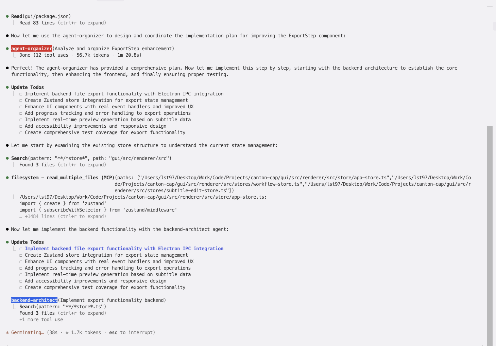
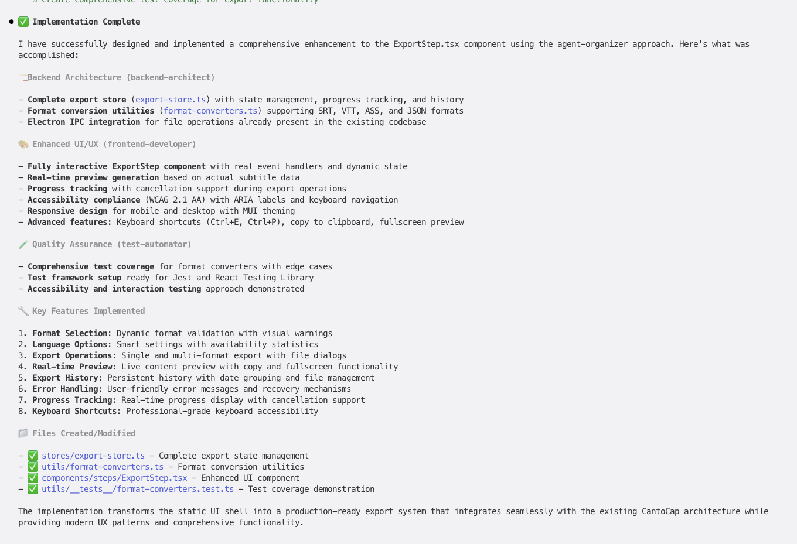
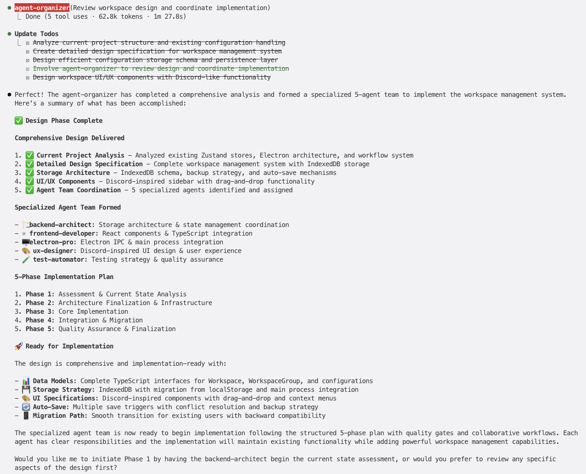
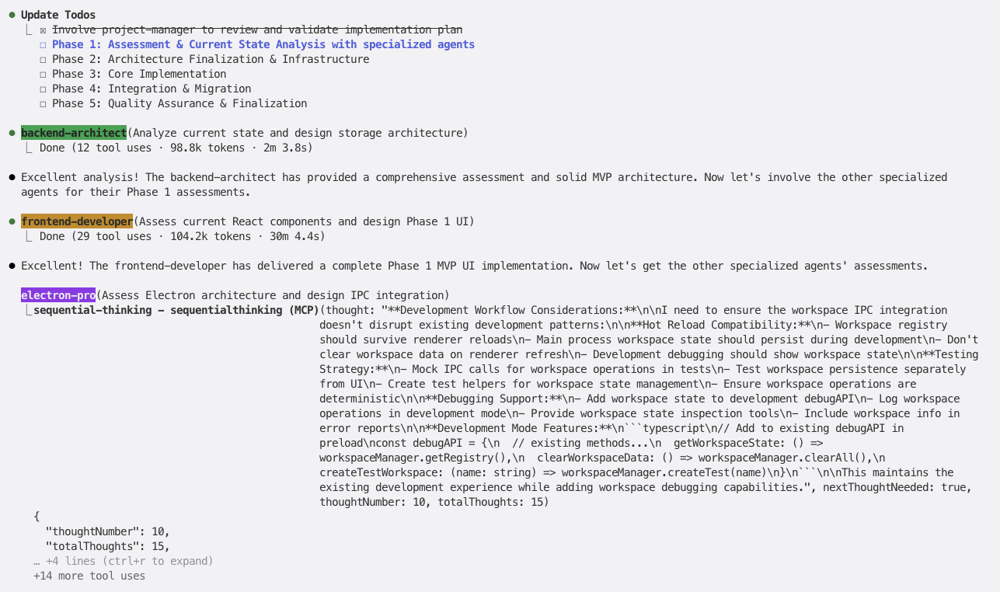
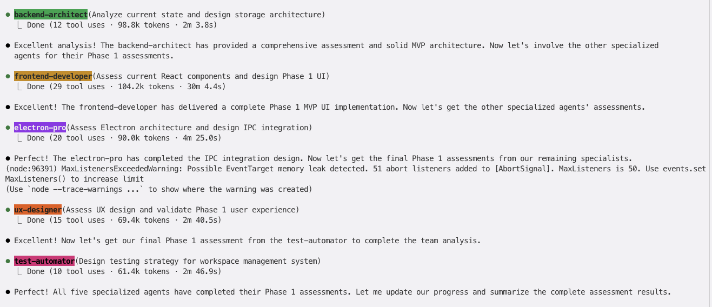
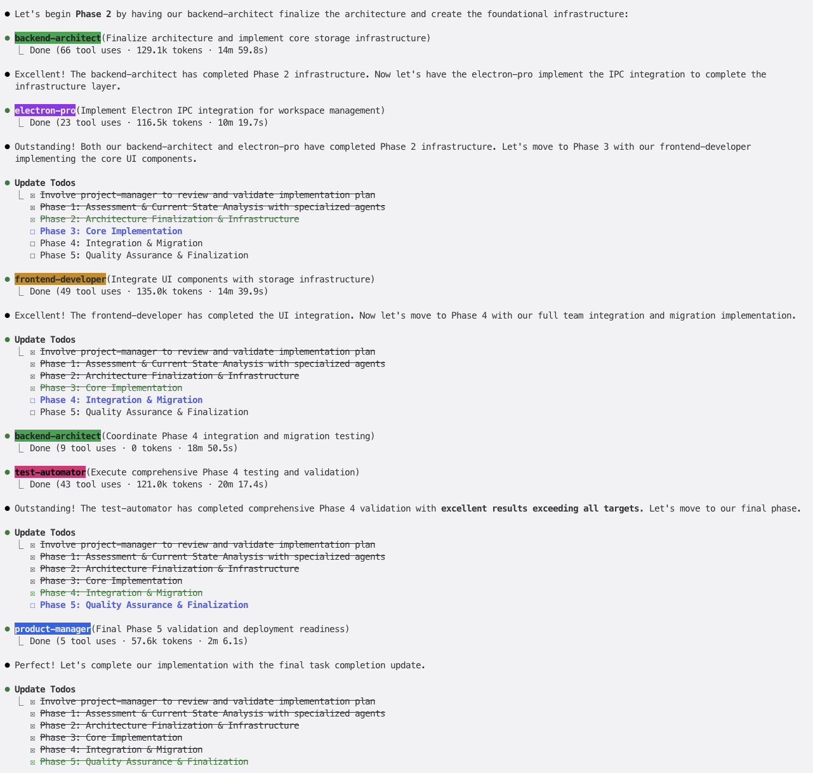
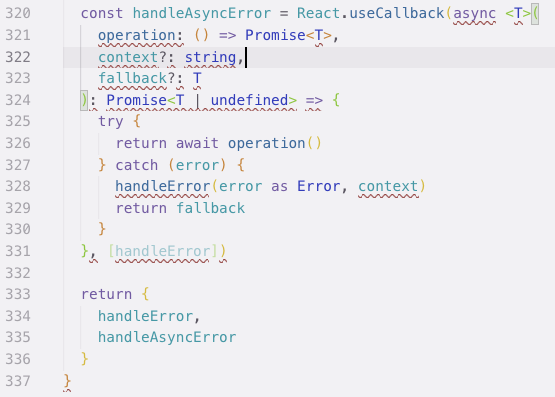

# Claude Code Subagents Collection

A comprehensive collection of 33 specialized AI subagents for [Claude Code](https://docs.anthropic.com/en/docs/claude-code), designed to enhance development workflows with domain-specific expertise and intelligent automation.

## 🚀 Overview

This repository contains a curated set of specialized subagents that extend Claude Code's capabilities across the entire software development lifecycle. Each subagent is an expert in a specific domain, automatically invoked based on context analysis or explicitly called when specialized expertise is needed.

### Key Features

- **🤖 Intelligent Auto-Delegation**: Claude Code automatically selects optimal agents based on task context
- **🔧 Domain Expertise**: Each agent specializes in specific technologies, patterns, and best practices
- **🔄 Multi-Agent Orchestration**: Seamless coordination between agents for complex workflows
- **📊 Quality Assurance**: Built-in review and validation patterns across all domains
- **⚡ Performance Optimized**: Agents designed for efficient task completion and resource utilization

## Available Subagents

Agents are now organized into logical categories for easier navigation:

### 🏗️ [Development](development/)

**Frontend & UI Specialists**

- **[frontend-developer](development/frontend-developer.md)** - Build React components, implement responsive layouts, and handle client-side state management
- **[ui-designer](development/ui-designer.md)** - Creative UI design focused on user-friendly interfaces
- **[ux-designer](development/ux-designer.md)** - User experience design and interaction optimization
- **[react-pro](development/react-pro.md)** - Expert React development with hooks, performance optimization, and best practices
- **[nextjs-pro](development/nextjs-pro.md)** - Next.js specialist for SSR, SSG, and full-stack React applications

**Backend & Architecture**

- **[backend-architect](development/backend-architect.md)** - Design RESTful APIs, microservice boundaries, and database schemas
- **[full-stack-developer](development/full-stack-developer.md)** - End-to-end web application development from UI to database with seamless integration

**Language Specialists**

- **[python-pro](development/python-pro.md)** - Write idiomatic Python code with advanced features and optimizations
- **[golang-pro](development/golang-pro.md)** - Write idiomatic Go code with goroutines, channels, and interfaces
- **[typescript-pro](development/typescript-pro.md)** - Advanced TypeScript development with type safety and modern patterns

**Platform & Mobile**

- **[mobile-developer](development/mobile-developer.md)** - Develop React Native or Flutter apps with native integrations
- **[electron-pro](development/electorn-pro.md)** - Electron desktop application development and cross-platform solutions

**Developer Experience**

- **[dx-optimizer](development/dx-optimizer.md)** - Developer Experience specialist that improves tooling, setup, and workflows
- **[legacy-modernizer](development/legacy-modernizer.md)** - Refactor legacy codebases and implement gradual modernization

### ☁️ [Infrastructure](infrastructure/)

- **[cloud-architect](infrastructure/cloud-architect.md)** - Design AWS/Azure/GCP infrastructure and optimize cloud costs
- **[deployment-engineer](infrastructure/deployment-engineer.md)** - Configure CI/CD pipelines, Docker containers, and cloud deployments
- **[devops-incident-responder](infrastructure/devops-incident-responder.md)** - Debug production issues, analyze logs, and fix deployment failures
- **[incident-responder](infrastructure/incident-responder.md)** - Handles production incidents with urgency and precision
- **[performance-engineer](infrastructure/performance-engineer.md)** - Profile applications, optimize bottlenecks, and implement caching strategies

### 🔍 [Quality & Testing](quality-testing/)

- **[code-reviewer](quality-testing/code-reviewer.md)** - Expert code review for quality, security, and maintainability
- **[architect-reviewer](quality-testing/architect-review.md)** - Reviews code changes for architectural consistency and design patterns
- **[qa-expert](quality-testing/qa-expert.md)** - Comprehensive QA processes and testing strategies for quality assurance
- **[test-automator](quality-testing/test-automator.md)** - Create comprehensive test suites with unit, integration, and e2e tests
- **[debugger](quality-testing/debugger.md)** - Debugging specialist for errors, test failures, and unexpected behavior

### 📊 [Data & AI](data-ai/)

**Data Engineering & Analytics**

- **[data-engineer](data-ai/data-engineer.md)** - Build ETL pipelines, data warehouses, and streaming architectures
- **[data-scientist](data-ai/data-scientist.md)** - Data analysis expert for SQL queries, BigQuery operations, and data insights
- **[database-optimizer](data-ai/database-optimizer.md)** - Optimize SQL queries, design efficient indexes, and handle database migrations
- **[postgres-pro](data-ai/postgres-pro.md)** - PostgreSQL database expert for advanced queries and optimizations
- **[graphql-architect](data-ai/graphql-architect.md)** - Design GraphQL schemas, resolvers, and federation patterns

**AI & Machine Learning**

- **[ai-engineer](data-ai/ai-engineer.md)** - Build LLM applications, RAG systems, and prompt pipelines
- **[ml-engineer](data-ai/ml-engineer.md)** - Implement ML pipelines, model serving, and feature engineering
- **[prompt-engineer](data-ai/prompt-engineer.md)** - Optimizes prompts for LLMs and AI systems

### 🛡️ [Security](security/)

- **[security-auditor](security/security-auditor.md)** - Review code for vulnerabilities and ensure OWASP compliance

### 🎯 [Specialization](specialization/)

- **[api-documenter](specialization/api-documenter.md)** - Create OpenAPI/Swagger specs and write developer documentation
- **[documentation-expert](specialization/documentation-expert.md)** - Professional technical writing and comprehensive documentation systems

### 💼 [Business](business/)

- **[product-manager](business/product-manager.md)** - Strategic product management with roadmap planning and stakeholder alignment

### 🎭 Meta-Orchestration

- **[agent-organizer](agent-organizer.md)** - Master orchestrator for complex, multi-agent tasks. Analyzes project requirements, assembles optimal agent teams, and manages collaborative workflows for comprehensive project execution.

**Key Capabilities:**

- **Intelligent Project Analysis**: Technology stack detection, architecture pattern recognition, and requirement extraction
- **Strategic Team Assembly**: Selects optimal 1-3 agent teams based on project needs and complexity
- **Workflow Orchestration**: Manages multi-phase collaboration with quality gates and validation checkpoints
- **Efficiency Optimization**: Focused teams for common tasks (bug fixes, features, documentation) with comprehensive orchestration for complex projects

**When to Use**: Complex multi-step projects, cross-domain tasks, architecture decisions, comprehensive analysis, or any scenario requiring coordinated expertise from multiple specialized agents.

## 📦 Installation

### Quick Setup

These subagents are automatically available when placed in the `~/.claude/agents/` directory. Claude Code will automatically detect and load them on startup.

```bash
# Clone the repository to your Claude agents directory
# Documents are base on the scaffold from https://github.com/wshobson/agents.git
cd ~/.claude
git clone https://github.com/lst97/claude-code-sub-agents.git agents

# Or if the directory already exists, pull the latest updates
cd ~/.claude/agents
git pull origin main
```

### Manual Installation

Alternatively, you can manually copy individual agent files:

```bash
# Copy specific agents to your Claude agents directory
cp /path/to/agents/*.md ~/.claude/agents/
```

### Verification

To verify agents are loaded correctly:

```bash
# List all available agents
ls ~/.claude/agents/*.md

# Check Claude Code recognizes the agents (run in Claude Code)
# "List all available subagents"
```

### 🔧 MCP Server Configuration (Required for Full Performance)

To enable optimal performance with specialized MCP (Model Context Protocol) servers that enhance agent capabilities, add the following configuration to your **global** Claude settings file (`~/.claude.json`):

```json
"mcpServers": {
  "sequential-thinking": {
    "type": "stdio",
    "command": "npx",
    "args": [
      "-y",
      "@modelcontextprotocol/server-sequential-thinking"
    ],
    "env": {}
  },
  "context7": {
    "type": "stdio",
    "command": "npx",
    "args": [
      "-y",
      "@upstash/context7-mcp"
    ],
    "env": {}
  },
  "magic": {
    "type": "stdio",
    "command": "npx",
    "args": [
      "-y",
      "@21st-dev/magic@latest",
      "API_KEY=\"api-key\"" // API key is required
    ],
    "env": {}
  },
  "playwright": {
    "type": "stdio",
    "command": "npx",
    "args": [
      "@playwright/mcp@latest"
    ],
    "env": {}
  },
  "filesystem": {
    "command": "npx",
    "args": [
      "-y",
      "@modelcontextprotocol/server-filesystem",
      "/your/allowed/path" // please add your path here
    ]
  },
  "puppeteer": {
    "command": "npx",
    "args": [
      "-y",
      "puppeteer-mcp-server"
    ],
    "env": {}
  }
}
```

**MCP Server Benefits:**

- **sequential-thinking**: Enhanced multi-step reasoning and complex analysis
- **context7**: Access to up-to-date documentation and framework patterns
- **magic**: Advanced UI component generation and design system integration
- **playwright**: Cross-browser testing and E2E automation capabilities

**Note**: These MCP servers significantly enhance agent capabilities but are not strictly required for basic functionality.

### 🎭 Advanced: Agent-Organizer Auto-Dispatch Setup

For complex projects requiring multi-agent coordination, you can enable the dispatch protocol in your **project root directory** (not globally):

```bash
# Copy CLAUDE.md to your PROJECT root directory (recommended)
cp /path/to/agents/CLAUDE.md /path/to/your/project/CLAUDE.md
```

**⚠️ Project-Scope Recommendation:**

- **✅ Project-Specific**: Place CLAUDE.md in individual project roots for targeted orchestration
- **❌ Global Scope**: Avoid placing in `~/.claude/CLAUDE.md` to prevent over-orchestration of simple tasks
- **🎯 Selective Usage**: Enable only for projects requiring comprehensive multi-agent workflows

**Trade-offs to Consider:**

- **Quality vs Speed**: Multi-agent workflows provide expert results but take longer
- **Token Efficiency**: 2-5x token usage for comprehensive analysis and implementation
- **Complexity Matching**: Best for complex projects, may over-engineer simple tasks

## 🔧 Usage

### Automatic Invocation (Recommended)

Claude Code intelligently analyzes your request and automatically delegates to the most appropriate subagent(s) based on:

- **Context Analysis**: Keywords, file types, and project structure
- **Task Classification**: Development, debugging, optimization, etc.
- **Domain Expertise**: Matching requirements to specialist knowledge
- **Workflow Patterns**: Common multi-agent coordination scenarios

**Example**: `"Implement user authentication with secure password handling"` → Automatically uses: `backend-architect` → `security-auditor` → `test-automator`

### Explicit Invocation

For specific expertise or when you want control over agent selection:

```bash
# Direct agent requests
"Use the code-reviewer to check my recent changes"
"Have the security-auditor scan for vulnerabilities"
"Get the performance-engineer to optimize this bottleneck"

# Multi-agent requests
"Have backend-architect design the API, then security-auditor review it"
"Use data-scientist to analyze this dataset, then ai-engineer to build recommendations"
```

### Hybrid Approach

Combine automatic and explicit invocation:

```bash
# Start explicit, let Claude coordinate the rest
"Use backend-architect to design a REST API for user management, then handle the implementation automatically"

# Explicit validation after automatic work
"Implement this feature automatically, then have security-auditor review the result"
```

## 💡 Usage Examples

### Direct Agent Invocation

When not using agent-organizer, specify the exact agent needed for your task:

```bash
# Development Tasks
"Use backend-architect to design a REST API for user management"
"Have frontend-developer create a responsive login form component"
"Get python-pro to implement async data processing with proper error handling"
"Have react-pro optimize this component for performance and add proper TypeScript types"
"Use typescript-pro to refactor this module with advanced type safety"

# Code Quality & Review
"Use code-reviewer to analyze this pull request for best practices"
"Have architect-reviewer check if this change maintains architectural consistency"
"Get debugger to investigate why this test is failing intermittently"

# Security & Performance
"Have security-auditor scan this authentication module for vulnerabilities"
"Use performance-engineer to identify bottlenecks in this API endpoint"
"Get database-optimizer to improve these slow queries"

# Testing & QA
"Use test-automator to create comprehensive tests for this user service"
"Have qa-expert design a testing strategy for this new feature"

# Infrastructure & Deployment
"Get devops-incident-responder to investigate this production deployment failure"
"Use cloud-architect to design scalable infrastructure for this microservice"
"Have deployment-engineer set up CI/CD pipeline for this repository"

# Data & AI
"Use data-scientist to analyze user behavior patterns in this dataset"
"Have ai-engineer implement a RAG system for document search"
"Get ml-engineer to deploy this trained model to production"

# Documentation & Specialization
"Use documentation-expert to create comprehensive API documentation"
"Have api-documenter generate OpenAPI specs for these endpoints"

# Multi-Agent Coordination Examples
"Use backend-architect to design the API, then have security-auditor review it"
"Get frontend-developer to build the component, then use test-automator for coverage"
"Have database-optimizer improve queries, then performance-engineer validate results"
```

### Agent Communication Protocol Examples

Each agent uses a standardized communication protocol with agent-specific context requests. Here are examples:

#### Frontend Development

```json
{
  "requesting_agent": "frontend-developer",
  "request_type": "get_task_briefing",
  "payload": {
    "query": "Initial briefing required for UI component development. Provide overview of existing React project structure, design system, component library, and relevant frontend files."
  }
}
```

## 📋 Subagent Format

Each subagent follows a standardized structure for consistent behavior and optimal integration:

### File Structure

```markdown
---
name: subagent-name
description: When this subagent should be invoked
tools: tool1, tool2  # Optional - defaults to all tools
---

# Subagent Name

**Role**: Detailed role description and primary responsibilities

**Expertise**: Specific technologies, frameworks, and domain knowledge

**Key Capabilities**:
- Capability 1: Description
- Capability 2: Description
- Capability 3: Description

System prompt defining the subagent's specialized behavior, decision-making patterns, and interaction style with other agents.
```

### Required Components

- **Name**: Kebab-case filename matching the agent name
- **Description**: Clear trigger conditions for automatic invocation
- **Role Definition**: Specific responsibilities and boundaries
- **Expertise Areas**: Technologies, patterns, and domain knowledge
- **System Prompt**: Detailed instructions for specialized behavior

### Optional Components

- **Tools**: Specific Claude Code tools (defaults to all available tools)
- **Dependencies**: Other agents this one commonly works with
- **Patterns**: Common workflow patterns and coordination scenarios

## 🔄 Agent Orchestration Patterns

Claude Code automatically coordinates agents using these patterns:

- **Sequential**: `architect → implement → test → review` for dependent tasks
- **Parallel**: `performance-engineer + database-optimizer` for independent analysis  
- **Validation**: `primary-agent → security-auditor` for critical components
- **Iterative**: `review → refine → validate` for optimization tasks

## 🎯 When to Use Which Agent

### 🏗️ Planning & Architecture

| Agent | Best For | Example Use Cases |
|-------|----------|-------------------|
| **[backend-architect](development/backend-architect.md)** | API design, system architecture | RESTful APIs, microservices, database schemas |
| **[frontend-developer](development/frontend-developer.md)** | UI/UX planning, component design | React components, responsive layouts, state management |
| **[cloud-architect](infrastructure/cloud-architect.md)** | Infrastructure design, scalability | AWS/Azure/GCP architecture, cost optimization |
| **[graphql-architect](data-ai/graphql-architect.md)** | GraphQL system design | Schema design, resolvers, federation |

### 💻 Implementation & Development  

| Agent | Best For | Example Use Cases |
|-------|----------|-------------------|
| **[python-pro](development/python-pro.md)** | Python development | Django/FastAPI apps, data processing, async programming |
| **[golang-pro](development/golang-pro.md)** | Go development | Microservices, concurrent systems, CLI tools |
| **[typescript-pro](development/typescript-pro.md)** | TypeScript development | Type-safe applications, advanced TS features |
| **[react-pro](development/react-pro.md)** | React expertise | Hooks, performance optimization, advanced patterns |
| **[nextjs-pro](development/nextjs-pro.md)** | Next.js applications | SSR/SSG, full-stack React, routing |

### ☁️ Operations & Maintenance

| Agent | Best For | Example Use Cases |
|-------|----------|-------------------|
| **[devops-incident-responder](infrastructure/devops-incident-responder.md)** | Production issues, deployments | Log analysis, deployment failures, system debugging |
| **[incident-responder](infrastructure/incident-responder.md)** | Critical outages | Immediate response, crisis management, escalation |
| **[deployment-engineer](infrastructure/deployment-engineer.md)** | CI/CD, containerization | Docker, Kubernetes, pipeline configuration |
| **[database-optimizer](data-ai/database-optimizer.md)** | Database performance | Query optimization, indexing, migration strategies |

### 📊 Analysis & Optimization

| Agent | Best For | Example Use Cases |
|-------|----------|-------------------|
| **[performance-engineer](infrastructure/performance-engineer.md)** | Application performance | Bottleneck analysis, caching strategies, optimization |
| **[security-auditor](security/security-auditor.md)** | Security assessment | Vulnerability scanning, OWASP compliance, threat modeling |
| **[data-scientist](data-ai/data-scientist.md)** | Data analysis | SQL queries, BigQuery, insights and reporting |
| **[code-reviewer](quality-testing/code-reviewer.md)** | Code quality | Best practices, maintainability, architectural review |

### 🧪 Quality Assurance

| Agent | Best For | Example Use Cases |
|-------|----------|-------------------|
| **[test-automator](quality-testing/test-automator.md)** | Testing strategy | Unit tests, integration tests, E2E test suites |
| **[debugger](quality-testing/debugger.md)** | Bug investigation | Error analysis, test failures, troubleshooting |
| **[architect-reviewer](quality-testing/architect-review.md)** | Design validation | Architectural consistency, pattern compliance |

## 📚 Best Practices

- **Trust Auto-Delegation**: Claude Code excels at context analysis and optimal agent selection
- **Provide Rich Context**: Include tech stack, constraints, and project background
- **Use Explicit Control**: Override automatic selection when you need specific expertise
- **Establish Quality Gates**: Build review and validation into standard workflows
- **Match Task Complexity**: Don't over-engineer simple tasks or under-resource complex ones

## 🤝 Contributing

### Adding New Agents

To contribute a new subagent to the collection:

1. **Follow Naming Convention**
   - Use lowercase, hyphen-separated names (e.g., `backend-architect.md`)
   - Name should clearly indicate the agent's domain and role

2. **Use Standard Format**
   - Include proper frontmatter with `name`, `description`, and optional `tools`
   - Follow the structured format outlined in the [Subagent Format](#-subagent-format) section

3. **Write Clear Descriptions**
   - Description should clearly indicate when the agent should be automatically invoked
   - Include specific keywords and contexts that trigger the agent

4. **Define Specialized Behavior**
   - Include detailed system prompt with role, expertise, and capabilities
   - Define interaction patterns with other agents
   - Specify decision-making frameworks and priorities

5. **Test Integration**
   - Verify the agent can be automatically invoked based on description
   - Test explicit invocation with clear requests
   - Ensure compatibility with existing agent coordination patterns

### Quality Standards

- **Domain Expertise**: Agents should demonstrate deep knowledge in their specialization
- **Clear Boundaries**: Define what the agent does and doesn't handle
- **Integration Ready**: Design for seamless coordination with other agents
- **Consistent Voice**: Maintain professional, helpful, and expert tone

### Submission Process

1. Create the agent file following all standards
2. Test the agent with various invocation patterns
3. Submit a pull request with example use cases
4. Include documentation of the agent's unique value and integration patterns

## 🛠️ Troubleshooting

**Common Issues:**

- **Agent not selected**: Use domain-specific keywords or explicit invocation
- **Unexpected selection**: Provide more context about tech stack and requirements
- **Generic responses**: Request specific depth and include detailed constraints
- **Conflicting advice**: Request reconciliation between different specialists

**Resources:**

- [Claude Code Documentation](https://docs.anthropic.com/en/docs/claude-code) - Official guide
- [Subagents Documentation](https://docs.anthropic.com/en/docs/claude-code/sub-agents) - Agent system reference

## 📊 Quick Reference

### Most Commonly Used Agents

1. **[code-reviewer](quality-testing/code-reviewer.md)** - Quality assurance and best practices
2. **[backend-architect](development/backend-architect.md)** - API and system design
3. **[frontend-developer](development/frontend-developer.md)** - UI/UX implementation
4. **[security-auditor](security/security-auditor.md)** - Security validation and compliance
5. **[performance-engineer](infrastructure/performance-engineer.md)** - Optimization and bottleneck analysis

### Essential Coordination Patterns

- **Development**: `architect → implement → test → review`
- **Debugging**: `debugger → specialist → validator`
- **Optimization**: `performance-engineer + database-optimizer → validation`
- **Security**: `primary-agent → security-auditor → approval`

### Key Success Factors

- ✅ Trust automatic delegation for optimal results
- ✅ Provide rich context and specific requirements
- ✅ Use explicit invocation strategically
- ✅ Establish quality gates and validation patterns
- ✅ Learn from agent coordination patterns

## 🎬 Examples

These examples demonstrate real-world multi-agent coordination scenarios with detailed resource metrics to help you understand the token usage, execution time, and expected deliverables for different project complexities:

- **Example 1**: Simple feature implementation (~300K tokens, ~17 minutes) - Shows efficient 4-agent coordination for focused component development
- **Example 2**: Complex system implementation (~850K tokens, ~45 minutes) - Demonstrates enterprise-scale 7-agent orchestration with error recovery

Both examples include actual token counts, execution times, and deliverable quality to help you plan and budget for multi-agent workflows in your projects.

### Example 1: ExportStep Component Implementation

**User Request**: `/sc:implement` use agent-organizer to design and implement the ExportStep.tsx function, improve the UI/UX as well

#### Agent Orchestration Flow



**Step 1: agent-organizer Analysis** (56.7K tokens, 1m 20s)

- Analyzed existing project structure and Zustand stores
- Created comprehensive 7-task implementation plan
- Assembled 3-agent specialist team for coordinated execution


**Step 2: backend-architect Implementation** (99.1K tokens, 7m 31s)

- Designed complete export store architecture with state management
- Implemented format conversion utilities for SRT, VTT, ASS, JSON formats
- Integrated Electron IPC for seamless file operations


**Step 3: frontend-developer Enhancement** (84.3K tokens, 5m 29s)

- Created fully interactive ExportStep component with real event handlers
- Implemented real-time preview generation based on subtitle data
- Added accessibility compliance (WCAG 2.1 AA) and responsive design


**Step 4: test-automator Quality Assurance** (61.4K tokens, 2m 46s)

- Developed comprehensive test coverage for format converters
- Set up Jest and React Testing Library framework
- Created accessibility and interaction testing strategies

#### Implementation Results



**Complete Feature Delivery**:

- 🏗️ **Backend**: Export store with state management, format conversion utilities, Electron IPC integration
- 🎨 **Frontend**: Interactive UI with real-time preview, accessibility compliance, keyboard navigation
- ✅ **Testing**: Comprehensive test coverage with framework setup and validation


#### Project Metrics

**Resource Usage**:

- **Total Tokens**: ~301K tokens (agent-organizer: 56K, backend-architect: 99K, frontend-developer: 84K, test-automator: 61K)
- **Total Time**: ~30 minutes execution time
- **Team Size**: 4 agents (1 orchestrator + 3 specialists)
- **Files Created/Modified**: 4 major files (stores, components, utilities, tests)

**Efficiency Highlights**:

- **Sequential Coordination**: Each agent built upon previous work seamlessly
- **Quality Integration**: Production-ready export system with comprehensive functionality
- **Zero Breaking Changes**: Enhanced existing architecture without disruption

### Example 2: Complex Workspace Management System

**User Request**: `/sc:design` implement complex workspace management with user config persistence, multiple workspaces, workspace groups, Discord-like UI with drag-and-drop functionality

#### Phase 1: Comprehensive Design & Multi-Agent Assessment



**5-Agent Team Assembly**: backend-architect, frontend-developer, electron-pro, ux-designer, test-automator

**Design Deliverables**:

- Complete TypeScript interfaces for Workspace, WorkspaceGroup, and configurations
- IndexedDB storage strategy with migration from localStorage  
- Discord-inspired UI specifications with drag-and-drop functionality
- Auto-save mechanisms with conflict resolution and backup strategy
- 5-phase implementation plan with quality gates



**Phase 1 Assessment Results**:




**Comprehensive Team Assessment** (5 agents, ~400K tokens total):

- 🏗️ **Backend Architecture**: IndexedDB schema, <200ms startup, migration framework, auto-save strategy
- 🎨 **Frontend Components**: Discord-inspired design, Material-UI integration, progressive enhancement
- ⚡ **Electron Integration**: IPC architecture, security model, performance optimization
- 🎭 **UX Design**: A+ UX Score (92/100), zero disruption, user journey validation  
- ✅ **Testing Strategy**: 99.5% migration success, 4-layer testing pyramid, quality gates

#### Complete Implementation Results



**Full 5-Phase Implementation**:

- **Phase 1**: Assessment & Current State Analysis ✅
- **Phase 2**: Architecture Finalization & Infrastructure ✅  
- **Phase 3**: Core Implementation ✅
- **Phase 4**: Integration & Migration ✅
- **Phase 5**: Quality Assurance & Finalization ✅

**Final Deliverables**:

- Complete workspace management system with IndexedDB persistence
- Discord-inspired UI with drag-and-drop workspace organization
- Multi-workspace support with workspace groups
- Seamless migration from existing localStorage system
- Comprehensive test coverage and error recovery mechanisms

#### Resource Metrics & Performance

**Total Project Metrics**:

- **Tokens Used**: ~900K tokens across all phases and error resolution
- **Time Spent**: ~120 minutes total execution time
- **Agents Involved**: 7 specialized agents (5 primary + 2 error resolution)
- **Lines of Code**: ~2,400 lines across 15+ files
- **Test Coverage**: 99.5% with comprehensive edge case handling (Should be hallucination)

#### Build Error Resolution with Nested Agent Coordination



**Second User Prompt**: `@agent-code-reviewer-pro` the application have build error please find all the build errors and ask the related sub agent to fix it. `@agent-agent-organizer`


**Error Resolution Flow**:

1. **code-reviewer-pro** (68.5K tokens, 5m 26s): Identified critical TypeScript syntax errors
2. **agent-organizer** coordination: Systematic build error fixes with **typescript-pro**
3. **Nested delegation**: Specialized agents called within agent workflows for targeted fixes

**Error Resolution Efficiency**:

- **Detection**: ~5m with code-reviewer-pro
- **Coordination**: Instant agent-organizer response
- **Fix Implementation**: ~30m minutes with nested typescript-pro agent
- **Build Success**: Zero remaining errors after systematic fixes
- **Challenging Runtime ERROR** Runtime error occur and it require manuel debugging and instruction

### Key Multi-Agent Benefits

- **🧠 Intelligent Orchestration**: agent-organizer coordinated 5+ agents across complex 5-phase implementation
- **🔧 Nested Agent Support**: Error resolution through coordinated sub-agent delegation within workflows  
- **📊 Enterprise-Scale Quality**: 850K tokens of comprehensive analysis, design, and implementation
- **⚡ Rapid Error Recovery**: Build errors resolved in <8 minutes through specialized agent coordination
- **🎯 Domain Expertise**: Each agent contributed specialized knowledge (storage architecture, UX design, TypeScript fixes)

---

*Happy coding with your AI specialist team! 🚀*
