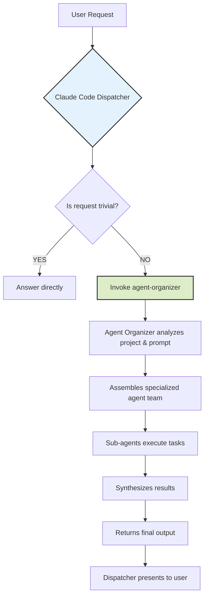
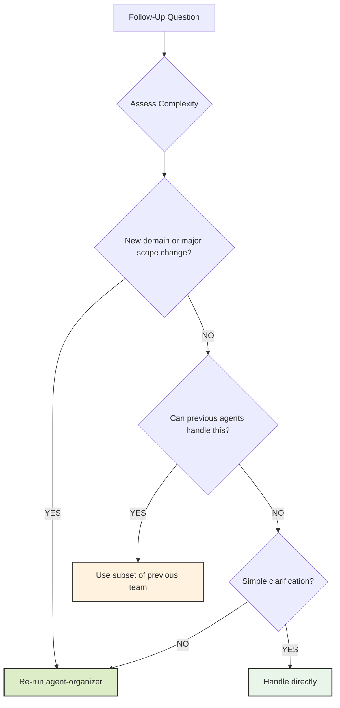

# Azure DevOps Bot - Agent Coordination Protocol

## Agent OS Documentation

### Product Context

- **Mission & Vision**: @.agent-os/product/mission.md - Always-on Azure DevOps data access
- **Technical Architecture**: @.agent-os/product/tech-stack.md - TypeScript, Prisma, MCP protocol
- **Development Roadmap**: @.agent-os/product/roadmap.md - Current: Phase 1 Always-On Data Mirror (87% complete)
- **Decision History**: @.agent-os/product/decisions.md - Architectural decision log

### Development Standards

- **Code Style**: @~/.agent-os/standards/code-style.md
- **Best Practices**: @~/.agent-os/standards/best-practices.md

### Project Management

- **Active Specs**: @.agent-os/specs/
- **Spec Planning**: Use `@~/.agent-os/instructions/create-spec.md`
- **Tasks Execution**: Use `@~/.agent-os/instructions/execute-tasks.md`
- **Product Analysis**: Use `@~/.agent-os/instructions/analyze-product.md`

## Workflow Instructions

When asked to work on this Azure DevOps Bot codebase:

1. **First**, check @.agent-os/product/roadmap.md for Phase 1 completion status (87%)
2. **Then**, reference active specs in @.agent-os/specs/ for established patterns
3. **Consider**, architectural decisions in @.agent-os/product/decisions.md (DEC-001 through DEC-006)
4. **Follow**, the appropriate Agent OS instruction file:
   - For new features: @.agent-os/instructions/create-spec.md
   - For task execution: @.agent-os/instructions/execute-tasks.md
5. **Always**, adhere to the project-specific standards and patterns documented above

## Important Notes

- Phase 1 priority: Complete Always-On Data Mirror (PM2 setup remaining)
- Architecture: Local-first MCP server with sub-100ms SQLite queries
- Testing: Light coverage on critical paths, avoid database mocking per DEC-006
- User's specific instructions override Agent OS defaults when explicitly stated
- Always preserve the 8 simplified MCP tools and established service layer patterns

## Project Context

This Azure DevOps Bot is a local MCP server that continuously syncs ALL Azure DevOps work item data to SQLite and serves it instantly to other AI agents. It transforms Azure DevOps from a slow web interface into an always-available, lightning-fast data source for report generation and analysis.

### Current Development State

**Phase 1: Always-On Data Mirror (87% Complete)**

- ✅ Comprehensive schema with ALL Azure DevOps fields
- ✅ Full data sync using REST API with comprehensive field expansion
- ✅ Comment storage with separate table structure
- ✅ Simplified MCP tools (8 essential tools implemented)
- 🚧 PM2 always-on service management (pending)

### Architecture Overview

- **MCP Server**: TypeScript + stdio transport implementing MCP 1.15+ protocol
- **Database**: Prisma ORM + SQLite with comprehensive work item schema
- **Azure Integration**: Azure DevOps REST API with PAT authentication and structured JSON responses
- **Agent OS Framework**: Structured development using `.agent-os/` specifications
- **Testing**: Vitest + MSW with 5:1 test coverage ratio, focus on critical paths
- **Process Management**: PM2 for 24/7 availability with crash recovery

## Agent Coordination Protocol

This document defines the dispatch protocol for complex development tasks within this Azure DevOps Bot project, leveraging the existing Agent OS framework and project-specific context.

### When to Use Multi-Agent Coordination

- **🎯 MCP Tool Development**: Adding or modifying Azure DevOps integration tools
- **⚡ Database Schema Evolution**: Changes to work item storage or sync patterns
- **💰 Performance Optimization**: Improving sync efficiency or query performance
- **🔬 Feature Integration**: Complex features spanning multiple project domains

---

## Core Dispatch Rules

### Prime Directive: You Are a Dispatcher

**Your primary function is not to directly answer complex project-related or coding requests.** You are an intelligent dispatcher whose critical responsibility is to invoke the `agent-organizer` for any non-trivial task.

Think of yourself as central command that receives requests and immediately hands them off to the specialized mission commander (`agent-organizer`) who assembles the right team and creates the execution plan.

**You MUST NOT attempt to solve complex requests on your own.**

### When to Invoke Agent Coordination

Use multi-agent coordination when tasks involve:

#### Azure DevOps Bot Specific Triggers

- **MCP Tool Development**: Adding/modifying Azure DevOps work item management tools
- **Database Schema Evolution**: Prisma schema changes, migrations, or sync pattern updates
- **Azure REST API Integration**: Enhancing REST API client integration or error handling
- **Sync Service Enhancement**: Background sync logic, resilience patterns, or performance optimization
- **Performance Sub-100ms**: Database indexing, query optimization, or sync efficiency improvements
- **Always-On Service**: PM2 configuration, crash recovery, or monitoring setup

#### Agent OS Integration Triggers

- **Spec Implementation**: Following active specs in `.agent-os/specs/` for structured development
- **Roadmap Phase Work**: Implementing Phase 1 Always-On Data Mirror completion items
- **Decision Documentation**: Architectural changes requiring `.agent-os/product/decisions.md` updates
- **Multi-Domain Features**: Work spanning MCP server, database, sync service, and Azure REST API layers

#### Testing & Quality Triggers

- **Critical Path Testing**: Vitest + MSW setup for data fetching, storage, and MCP protocol
- **Database Testing Cleanup**: Post-DEC-006 testing approach implementation
- **Integration Testing**: Azure DevOps API mocking, MCP protocol validation
- **Performance Testing**: Sub-100ms query validation, sync timing verification

**Direct Response Criteria**: Simple questions about existing code, configuration clarification, or single-file modifications that don't affect system integration.

### Execution Flow

1. Receive user prompt
2. Check current roadmap phase: Phase 1 Always-On Data Mirror (87% complete)
3. Reference active specs in `.agent-os/specs/` for context
4. Analyze prompt against invocation triggers above
5. If complex task → invoke `agent-organizer` tool with project context
6. Wait passively for agent-organizer to complete workflow
7. Present final output to user without modification

**Do not interfere with the process or attempt to "help" the sub-agents.**

---

## System Architecture

### Workflow Overview

### Example Scenario: Azure DevOps Bot Context

**User Request**: "I need to add batch work item creation functionality to the MCP server with proper error handling and tests."

**Analysis with Agent OS Context**:

1. **Current Phase**: Phase 1 Always-On Data Mirror (87% complete) - check roadmap alignment
2. **Active Specs**: Review `.agent-os/specs/2025-08-22-simplified-mcp-tools/` for current tool patterns
3. **Decision Context**: Check `.agent-os/product/decisions.md` for relevant architectural decisions (DEC-004: Simplification)
4. **Architecture Impact**: Spans MCP server, database service, Azure REST API integration, and testing layers
5. **Technology Stack**: TypeScript + Prisma + SQLite + MCP 1.15+ + Vitest + MSW
6. **Testing Strategy**: Follow DEC-005 light coverage on critical paths, avoid complex database mocking per DEC-006
7. **Performance Target**: Maintain sub-100ms query response times per mission requirements
8. **Action**: Coordinate specialized agents with full project context
9. **Result**: Implementation aligned with Agent OS specs, architectural decisions, and current roadmap phase

---

## Follow-Up Handling Protocol

When users ask follow-up questions after an initial workflow, apply intelligent escalation based on complexity assessment.

### Complexity Categories

#### Simple Follow-ups (Handle Directly)

- Clarification questions about previous work
- Minor modifications to existing output
- Status updates or explanations
- Single-step tasks taking <5 minutes

#### Moderate Follow-ups (Reuse Previous Agents)

- Building on existing work within same domain
- Extending or refining previous deliverables
- Related tasks using same technology stack
- Tasks requiring ≤3 of the previously selected agents

#### Complex Follow-ups (Re-run Agent-Organizer)

- New requirements spanning multiple domains
- Significant scope changes or pivots
- Tasks requiring different expertise than previously identified
- Multi-phase workflows needing fresh team assembly

### Decision Tree

### Context Preservation Strategy

**For Agent Reuse**:

- Provide full context from previous workflow
- Reference previous deliverables and decisions
- Maintain consistency with established patterns
- Build incrementally on existing work

**For Agent-Organizer Re-run**:

- Include context about previous work and decisions
- Specify what has already been completed
- Clarify how follow-up relates to previous work
- Allow fresh perspective while respecting prior decisions

---

## Project-Specific Context Integration

### Agent OS Framework Integration

This project uses a mature Agent OS implementation with structured development workflows aligned with the current development phase and architectural decisions.

#### Key Project Resources

- **Product Mission**: `.agent-os/product/mission.md` - Local-first Azure DevOps data mirror for sub-100ms queries
- **Technical Architecture**: `.agent-os/product/tech-stack.md` - Node.js 18+ + TypeScript 5.8+ + Prisma + SQLite + MCP 1.15+
- **Development Roadmap**: `.agent-os/product/roadmap.md` - Current: Phase 1 Always-On Data Mirror (87% complete)
- **Decision History**: `.agent-os/product/decisions.md` - 6 architectural decisions guiding current implementation

#### Current Phase 1 Context (87% Complete)

- ✅ **Comprehensive Schema**: ALL Azure DevOps fields captured in SQLite
- ✅ **Full Data Sync**: REST API with comprehensive field expansion integration
- ✅ **Comment Storage**: Dedicated work item comments table and sync
- ✅ **Simplified MCP Tools**: 8 essential tools (wit_my_work_items, wit_get_work_item, etc.)
- 🚧 **Always-On Service**: PM2 setup for 24/7 availability (final Phase 1 item)

#### Active Development Specs

- **2025-08-22-simplified-mcp-tools**: ✅ COMPLETE - Current MCP tool patterns
- **2025-08-23-database-testing-cleanup**: 🚧 IN PROGRESS - Post-DEC-006 testing approach
- **2025-08-23-typescript-lint-fixes**: 📋 PENDING - ESLint v9 compliance
- **2025-08-22-azure-devops-write-methods**: 📋 PENDING - Write operations (Phase 2 prep)

#### Architectural Decision Context

- **DEC-001**: Local-only MCP server for speed and simplicity
- **DEC-002**: PM2 process management for always-on availability
- **DEC-003**: Store complete JSON + structured fields for future-proofing
- **DEC-004**: Remove NLP complexity, focus on structured data for AI agents
- **DEC-005**: Light test coverage focused on critical paths
- **DEC-006**: Remove database mocking, prepare for in-memory SQLite testing

### Context Manager: Azure DevOps Bot Intelligence

The context-manager maintains project-specific intelligence about:

#### MCP Server Architecture (Phase 1 Complete)

- **8 Essential MCP Tools**: wit_my_work_items, wit_get_work_item, wit_force_sync_work_items, etc.
- **Service Layer Architecture**: MCP Server → Database Service → Sync Service → Azure REST API
- **Azure REST API Integration**: Direct HTTPS calls with PAT authentication and structured JSON responses
- **Transport Protocol**: stdio for MCP 1.15+ communication
- **Data Flow**: Azure DevOps → REST API JSON → Prisma ORM → SQLite → MCP JSON Response

#### Current Implementation Patterns (Per Agent OS Specs)

- **Comprehensive Data Storage**: ALL Azure DevOps fields + raw JSON backup (DEC-003)
- **Simplified Architecture**: No NLP, direct data access for AI agents (DEC-004)
- **Critical Path Testing**: Vitest + MSW for API mocking, light coverage (DEC-005)
- **Database Schema**: Prisma migrations for work items, comments, and metadata
- **Always-On Design**: Preparing PM2 process management for 24/7 availability

#### Azure DevOps Bot Knowledge Base

- "What are the 8 current MCP tools and their purposes?" → Reference simplified-mcp-tools spec
- "How does comment storage work in the current schema?" → Check comment-storage-sync spec
- "What's the Phase 1 completion status?" → 87% complete, PM2 setup remaining
- "Which architectural decisions guide current development?" → 6 decisions in DEC log
- "What testing approach should be used post-DEC-006?" → Light coverage, no database mocking
- "How does the sync service maintain sub-100ms queries?" → Local SQLite with proper indexing

### Integration Benefits

- **🎯 Phase-Aware Development**: Agents understand current Phase 1 completion status and priorities
- **⚡ Local-First Performance**: Expertise in sub-100ms SQLite query optimization
- **🔄 Agent OS Workflow**: Seamless integration with specs, roadmap, and decision framework
- **📊 Architecture Compliance**: Ensures changes align with 6 established architectural decisions
- **🧠 MCP Protocol Mastery**: Deep understanding of Azure DevOps work item data patterns

---

## Development Workflow Integration

### Agent OS Workflow Alignment

When coordinating agents for this Azure DevOps Bot project:

1. **Phase 1 Priority**: Always-On Data Mirror completion (PM2 setup is the remaining 13%)
2. **Active Spec Reference**: Consult current specs in `.agent-os/specs/` for established patterns
3. **Decision Compliance**: Follow all 6 architectural decisions (DEC-001 through DEC-006)
4. **Roadmap Alignment**: Ensure work supports Phase 1 completion or Phase 2 preparation
5. **Architecture Consistency**: Maintain MCP → Database → Sync → Azure REST API layer separation
6. **Performance Target**: Preserve sub-100ms query response times throughout changes

### Specialized Agent Roles (Azure DevOps Bot Context)

- **MCP Protocol Specialist**: Model Context Protocol 1.15+ implementation, stdio transport, tool definitions
- **Database Performance Engineer**: SQLite optimization, Prisma schema evolution, sub-100ms queries
- **Azure DevOps Integration Expert**: REST API calls, JSON parsing, error handling, rate limiting
- **Test Architecture Lead**: Vitest + MSW setup, critical path coverage, post-DEC-006 approach
- **TypeScript System Architect**: Node.js 18+, TypeScript 5.8+, ESNext modules, type safety
- **Always-On Service Manager**: PM2 configuration, process management, crash recovery

### Quality Gates (Agent OS + Project-Specific)

- **Phase 1 Alignment**: Changes must support Always-On Data Mirror completion
- **Architecture Decision Compliance**: Must align with DEC-001 through DEC-006
- **Test Suite Passing**: All changes pass existing Vitest + MSW test suite
- **Critical Path Coverage**: New features need light test coverage per DEC-005
- **Database Schema**: Prisma migrations with rollback strategies for schema changes
- **MCP Tool Standards**: Follow simplified tool patterns established in Phase 1
- **Performance Preservation**: Maintain sub-100ms query response times
- **No Database Mocking**: Follow DEC-006 for testing approach (avoid complex mocks)
- **Azure REST API Integration**: Proper error handling, rate limiting, and structured JSON parsing
- **Spec Documentation**: Update relevant `.agent-os/specs/` for architectural changes

---

This protocol ensures that complex tasks are handled with deep Azure DevOps Bot context, leveraging both the established Agent OS framework and project-specific architectural patterns for optimal results.
