# Azure DevOps Bot - MCP Server for Lightning-Fast Work Item Access

[](docs/badges/production-environment-validation.md) [](#performance-benchmarks) [](https://modelcontextprotocol.io)

Transform Azure DevOps into an AI-powered, always-available data source. Get instant access to work items through the Model Context Protocol (MCP) - compatible with Claude Desktop, VS Code, and any MCP client.

⚡ **Sub-100ms Response Times** - Local SQLite database for instant queries  
🤖 **8 Production-Validated MCP Tools** - Complete work item management  
🔌 **Universal MCP Integration** - Works with Claude Desktop & VS Code  
📊 **1,056+ Work Items Tested** - Production validated with real data  
🛡️ **24/7 Availability** - PM2 process management with crash recovery

## 🚀 Quick Start - 5 Minutes to First Query

### Prerequisites
- Node.js 18+ and pnpm installed
- Azure DevOps Personal Access Token (PAT)
- Claude Desktop or VS Code with Copilot

### Step 1: Clone and Install
```bash
git clone https://github.com/nathanvale/azure-devops-bot.git
cd azure-devops-bot
pnpm install
```

### Step 2: Get Your PAT Token
1. Go to [Azure DevOps → User Settings → Personal Access Tokens](https://dev.azure.com/fwcdev/_usersSettings/tokens)
2. Create token with **"Work Items (read & write)"** scope
3. Copy the token

### Step 3: Set Environment Variable
```bash
export AZURE_DEVOPS_PAT="your-token-here"
```

### Step 4: Test the Server
```bash
pnpm mcp --emails=your.email@fwc.gov.au
# You should see: "✅ MCP server started successfully"
```

### Step 5: Connect Your Client
- [🤖 Claude Desktop Setup](#-claude-desktop-setup) (Recommended)
- [💻 VS Code Setup](#-vs-code-setup)

## 🤖 Claude Desktop Setup

### Configuration Location
- **macOS**: `~/Library/Application Support/Claude/claude_desktop_config.json`
- **Windows**: `%APPDATA%\Claude\claude_desktop_config.json`
- **Linux**: `~/.config/claude/claude_desktop_config.json`

### Add Azure DevOps Bot Configuration

1. Open your `claude_desktop_config.json` file
2. Add this configuration:

```json
{
  "mcpServers": {
    "azure-devops-bot": {
      "command": "pnpm",
      "args": ["mcp", "--emails=your.email@fwc.gov.au,team@fwc.gov.au"],
      "cwd": "/absolute/path/to/azure-devops-bot",
      "env": {
        "AZURE_DEVOPS_PAT": "your-personal-access-token-here"
      }
    }
  }
}
```

3. **Restart Claude Desktop**
4. Look for the MCP indicator (🔌) in the chat interface
5. Try: *"Show my active work items"*

## 💻 VS Code Setup

### Method 1: Workspace Configuration (Team Sharing)

1. Create `.vscode/mcp.json` in your workspace:

```json
{
  "servers": {
    "azure-devops-bot": {
      "type": "stdio",
      "command": "pnpm",
      "args": ["mcp", "--emails=${input:emails}"],
      "cwd": "/absolute/path/to/azure-devops-bot",
      "env": {
        "AZURE_DEVOPS_PAT": "${input:azure-pat}"
      }
    }
  },
  "inputs": [
    {
      "type": "promptString",
      "id": "emails",
      "description": "Enter comma-separated email addresses",
      "default": "your.email@fwc.gov.au"
    },
    {
      "type": "promptString",
      "id": "azure-pat",
      "description": "Azure DevOps Personal Access Token",
      "password": true
    }
  ]
}
```

2. Open Chat view (`Ctrl+Alt+I`)
3. Select **"Agent"** mode
4. Click **Tools** → Select azure-devops-bot tools
5. Start using work item queries!

### Method 2: Global User Configuration

1. Run Command Palette: `MCP: Add Server`
2. Choose **"stdio"** transport
3. Enter configuration:
   - **Command**: `pnpm`
   - **Args**: `mcp --emails=your.email@fwc.gov.au`
   - **Working Directory**: `/path/to/azure-devops-bot`
4. Select **"Global"** to add to user profile

### Method 3: Command Line Installation

```bash
code --add-mcp "{\"name\":\"azure-devops-bot\",\"command\":\"pnpm\",\"args\":[\"mcp\",\"--emails=your.email@fwc.gov.au\"],\"cwd\":\"/path/to/azure-devops-bot\"}"
```

## 🏗️ How It Works

```mermaid
graph LR
    A[Claude Desktop<br/>or VS Code] -->|MCP Protocol<br/>stdio| B[Azure DevOps Bot<br/>MCP Server]
    B -->|REST API| C[Azure DevOps<br/>Organization]
    B -->|Prisma ORM| D[SQLite DB<br/>Local Cache]
    
    B -->|2min sync| C
    D -->|<100ms| B
    C -->|Initial sync<br/>≤30s for 1000+ items| D
```



**Data Flow:**
1. MCP clients send tool requests via stdio transport
2. Server checks local SQLite for instant responses (<100ms)
3. Background sync every 2 minutes keeps data fresh
4. Force sync available for immediate updates

## 📚 MCP Tools Reference

All tools return JSON responses for AI processing. No natural language processing needed.

### Core Tools

#### 🔄 `wit_force_sync_work_items`
Force immediate sync with Azure DevOps (bypasses 2-minute interval)

**Parameters:**
```json
{
  "concurrency": 5  // Optional: 1-20, default 5
}
```

#### 👤 `wit_my_work_items`
Get all work items assigned to configured users

**Parameters:** None

**Usage:** *"Show my active work items"*

#### 📋 `wit_get_work_item`
Get single work item by ID with all fields

**Parameters:**
```json
{
  "id": 12345
}
```

**Usage:** *"Get details for work item 12345"*

#### 📦 `wit_get_work_items_batch_by_ids`
Get multiple work items by IDs in a single request

**Parameters:**
```json
{
  "ids": [12345, 12346, 12347]
}
```

**Usage:** *"Get work items 12345, 12346, and 12347"*

#### 💬 `wit_list_work_item_comments`
Get all comments for a work item

**Parameters:**
```json
{
  "id": 12345
}
```

**Usage:** *"Show comments for work item 12345"*

#### 🏃‍♂️ `wit_get_work_items_for_iteration`
Get all work items for a specific sprint/iteration

**Parameters:**
```json
{
  "iterationPath": "Sprint 24"
}
```

**Usage:** *"Show all work items in Sprint 24"*

#### ✍️ `wit_add_work_item_comment`
Add a comment to a work item

**Parameters:**
```json
{
  "id": 12345,
  "comment": "Updated status - testing complete"
}
```

**Usage:** *"Add comment 'Testing complete' to work item 12345"*

#### 🔗 `wit_link_work_item_to_pull_request`
Link a work item to an existing pull request

**Parameters:**
```json
{
  "workItemId": 12345,
  "pullRequestId": 678
}
```

**Usage:** *"Link work item 12345 to PR 678"*

## ⚡ Performance Benchmarks

| Metric | Target | Actual | Status |
|--------|--------|---------|--------|
| **Full Sync** | ≤30 seconds | 10-30 seconds | ✅ |
| **Query Response** | ≤100ms | Sub-100ms | ✅ |
| **Memory Usage** | Stable | No leaks detected | ✅ |
| **Uptime** | 99.9% | 24/7 with PM2 | ✅ |

*Validated with 1,056+ real work items from fwcdev organization*

## 🔧 Troubleshooting

### Common Issues

#### PAT Authentication Failed
- **Symptom**: "Authentication failed" error
- **Solution**: 
  1. Verify PAT has "Work Items (read & write)" scope
  2. Check PAT hasn't expired
  3. Ensure PAT is for correct organization (fwcdev)

#### MCP Server Not Appearing in Claude/VS Code
- **Symptom**: No MCP indicator or tools available
- **Check**:
  1. Server is running: `pnpm mcp --emails=test@fwc.gov.au`
  2. Configuration file path is correct
  3. Restart Claude Desktop/VS Code after config changes

#### Performance Issues
- **Symptom**: Slow queries (>100ms)
- **Solution**:
  1. Check SQLite database size: `ls -lh prisma/dev.db`
  2. Run manual sync: Use `wit_force_sync_work_items`
  3. Check memory usage in PM2: `pm2 monit`

### Debug Mode
```bash
# Run with debug output
DEBUG=* pnpm mcp --emails=your.email@fwc.gov.au

# Check server logs
tail -f logs/azure-devops-bot.log

# View MCP protocol messages (VS Code)
# View → Output → Select "MCP" from dropdown
```

## 🚀 Production Deployment (24/7 Operation)

### PM2 Process Management

```bash
# Install PM2 globally
npm install -g pm2

# Configure your email in ecosystem.config.js
# Then start the service
pm2 start ecosystem.config.js --env production

# Enable startup on boot
pm2 startup
pm2 save
```

### Commands
```bash
pm2 status           # Check service status
pm2 logs azure-devops-bot  # View logs
pm2 restart azure-devops-bot  # Restart service
pm2 monit           # Performance monitoring
```

**Production Features:**
- Automatic crash recovery
- Memory leak detection
- Boot persistence (macOS LaunchAgent)
- Log rotation and management

## 🏢 Architecture & Configuration

### Target Organization
- **Organization**: `fwcdev`
- **Project**: `Customer Services Platform`
- **API Version**: `7.0`

### Database Schema
- **Engine**: SQLite with Prisma ORM
- **Work Items**: Comprehensive metadata storage
- **Comments**: Separate table with full history
- **Sync Status**: Tracks last update timestamps

### MCP Protocol Implementation
- **Version**: MCP 1.15+
- **Transport**: stdio (Standard Input/Output)
- **Authentication**: PAT-based
- **Error Handling**: Comprehensive with user-friendly messages

## 🧪 Testing

### Test Coverage
- **Unit Tests**: 212 tests covering all services
- **Performance Tests**: Production environment validation
- **Integration Tests**: MCP server protocol testing
- **Database Tests**: SQLite and Prisma testing

### Running Tests
```bash
# Run all tests
pnpm test

# Run with coverage
pnpm test:coverage

# Run performance validation
pnpm test:performance

# Run in watch mode
pnpm test:watch
```

## 📝 Development Scripts

```bash
# Development
pnpm dev                 # Run CLI version
pnpm mcp                 # Run MCP server

# Building
pnpm build              # Compile TypeScript
pnpm type-check         # Check types only

# Database
pnpm db:reset           # Reset database
pnpm prisma studio      # Database GUI

# Process Management
pnpm pm2:setup          # Initial PM2 setup
pnpm pm2:validate       # Validate PM2 config
```

## 🔗 Related Documentation

- [Quick Start Guide](docs/QUICK_START.md) - 5-minute setup
- [MCP Integration Guide](docs/MCP_INTEGRATION.md) - Detailed configuration
- [Production Deployment](docs/PM2_PRODUCTION.md) - 24/7 operation setup
- [Production Validation Badge](docs/badges/production-environment-validation.md) - Testing results

## 📄 License

ISC License - See LICENSE file for details.

## 🤝 Contributing

This project is specifically designed for the FWC development team. For issues or improvements:

1. Create an issue describing the problem
2. Fork and create a feature branch
3. Submit a pull request with tests

---

*Built with ❤️ for the FWC development team. Production validated and ready for 24/7 operation.*